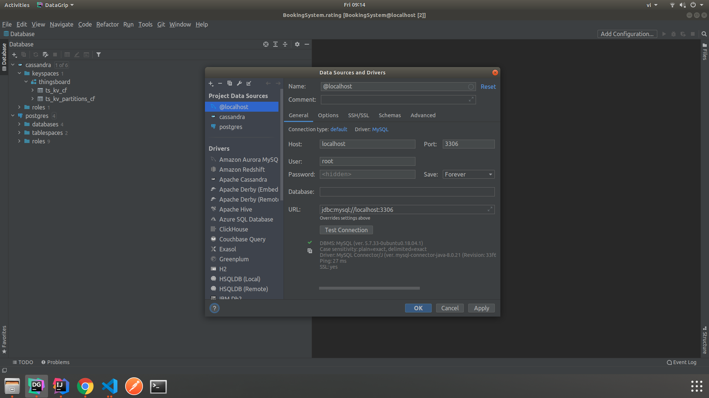
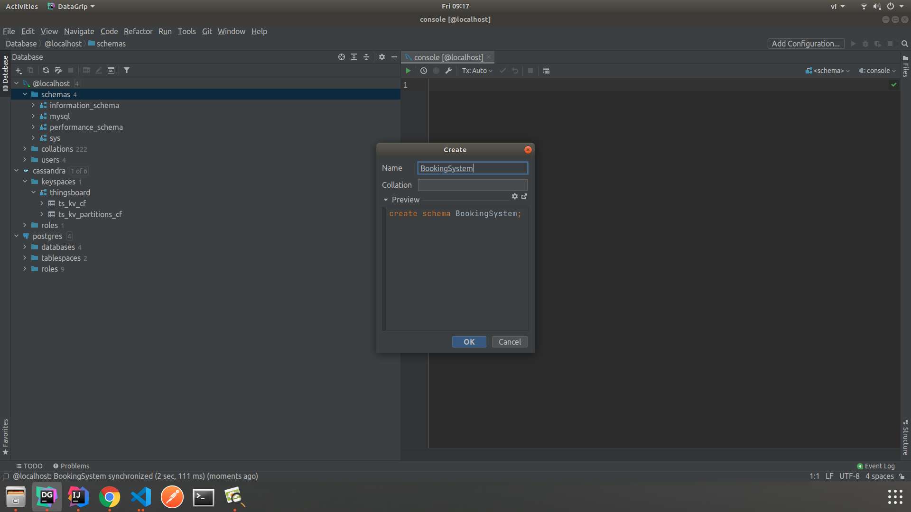
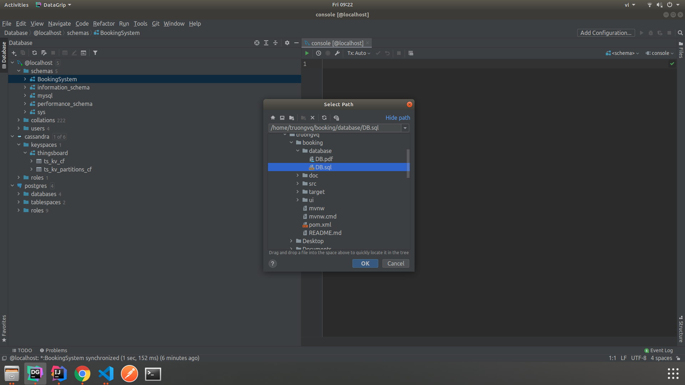

# Booking hotel 


## Yêu cầu hệ thống

Hệ thống xây dựng webservice trên nền tảng Java Spring Boot với Database MySQL, giao diện trên nền tảng React JS

Yêu cầu
- Java 8
- Maven
- MySQL
- npm 

## Cài đặt hệ thống

Clone project

```bash
git clone https://github.com/traidat/Booking
```

### Thiết lập cơ sở dữ liệu

Dưới đây là hướng dẫn thiết lập thông qua DataGrip. Bạn có thể  sử  dụng bất kì IDE nào support MySQL

- Tạo kết nối tới MySQL 



- Tạo một schema 



- Run script từ file database/DB.sql



### Thiết lập webservice

Dưới đây là hướng dẫn chạy webservice thông qua IntelliJ IDEA Ultimate Edition. Bạn có thể  sử dụng bất kì IDE nào support maven và Tomcat

- Mở project bằng IntelliJ 

- Thay đổi thiết lập MySQL trong file [src/main/resources/application.properties](src/main/resources/application.properties)

```Java
spring.datasource.url=YOUR_CONNECT_URL_TO_MYSQL
spring.datasource.driver-class-name=com.mysql.cj.jdbc.Driver
spring.datasource.username=YOUR_MYSQL_USERNAME
spring.datasource.password=YOUR_MYSQL_PASSWORD
```

- Chạy file [src/main/java/com/booking/BookingApplication.java](src/main/java/com/booking/BookingApplication.java)

### Thiết lập giao diện

```bash
cd ui/react-booking/
npm install
npm start
```

Mở trình duyệt ở đường dẫn https://localhost:3000/


## Mô tả hệ thống

Hệ thống đặt phòng khách sạn online với 2 loại người dùng chính
- Tourist: Người dùng phổ thông với nhu cầu đặt phòng trên hệ thống
- Agent: Người dùng đại diện cho khách sạn vói khả năng thêm thông tin của khách sạn lên hệ thống.

### Các chức năng dành cho người dùng Tourist

- Đăng ký, đăng nhập vào hệ thống
- Tìm thông tin khách sạn
- Đặt phòng khách sạn
- Xem thông tin các đơn đã đặt
- Hủy phòng đã đặt
- Bình luận đánh giá phòng đã hoàn thành trải nghiệm
- Đăng nhập bằng Facebook (chưa tích hợp do vấn đề  xác thực)

### Các chức năng dành cho người dùng Agent

- Đăng ký, đăng nhập vào hệ thống
- Thêm thông tin khách sạn 
- Thêm thông tin về phòng trong một khách sạn
- Xem các đơn của khách sạn
- Xem các thông số của khách sạn
- Trả lời các bình luận về khách sạn

## Hướng dẫn sử  dụng các chức năng

Hướng dẫn sử  dụng chi tiết được mô tả trong [document/userManual.pdf](document/userManual.pdf)


